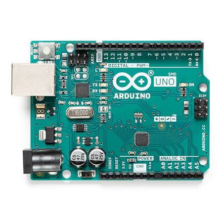
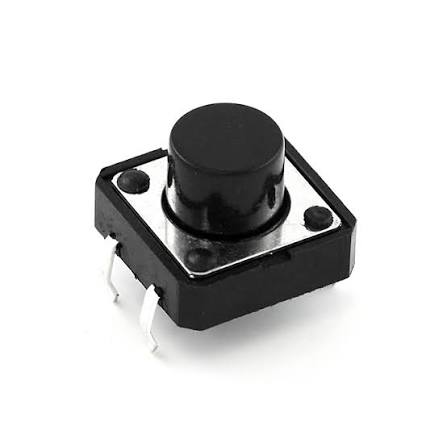
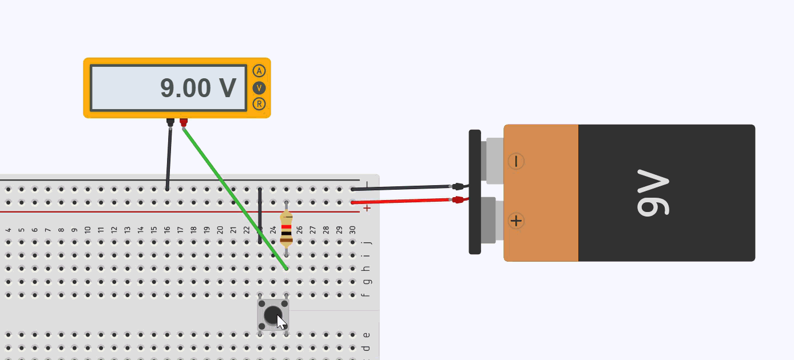
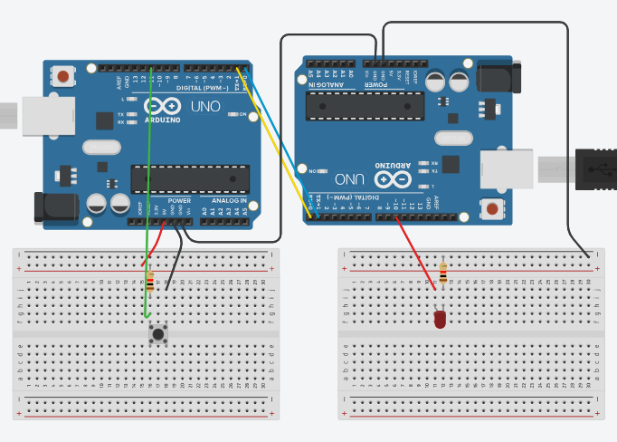

# 🔌 درس اليوم: التحدث مع الأصدقاء عبر السلك — UART Serial

---

## 🤔 ما هو UART؟ ببساطة!

الـ UART هو بروتوكول (طريقة) يتحدث فيها Arduino مع Arduino آخر — أو مع الكمبيوتر — عبر سلكين فقط:

| السلك             | الوظيفة           |
| ----------------- | ----------------- |
| **TX** (Transmit) | يرسل الرسالة 📤   |
| **RX** (Receive)  | يستقبل الرسالة 📥 |

> 💡 **القاعدة الذهبية:** TX للأول ← نوصله ب ← RX للثاني (و العكس صحيح!)

---

## 🧠 ما نعرفه بالفعل

```cpp
Serial.begin(9600);        // نفتح "القناة" بسرعة 9600
Serial.print("مرحبا");     // نرسل نص
Serial.println("!");       // نرسل نص + سطر جديد
Serial.available();        // هل وصلت رسالة؟ (نعم/لا)
Serial.read();             // نقرأ حرفاً واحداً
```

---

## 🎯 تجربة اليوم: "التحكم عن بُعد بالزر"

### الفكرة
فريق من شخصين. **Arduino A** لديه LED. **Arduino B** لديه زر ضغط.  
عندما يضغط **الشخص ب** على الزر → يرسل إشارة عبر السلك → **Arduino A** يستقبلها ويشغل/يطفي LED!

---

## 🛠️ القطع المطلوبة

| القطعة | العدد | ملاحظة |
|--------|-------|--------|
| Arduino Uno | 2 | واحد للمرسل، واحد للمستقبل |
| LED | 1 | على Arduino A |
| مقاومة 220Ω | 1 | للLED |
| زر ضغط (Push Button) | 1 | على Arduino B |
| مقاومة 10KΩ | 1 | للزر (سحب للأسفل) |
| أسلاك توصيل | 5+ | للتوصيل الداخلي والخارجي |
| كابل USB | 2 | لرفع الكود على كل Arduino |


**الشكل 1:** شكل لوحة الأردوينو أونو (Arduino Uno).

---

## 🔗 التوصيل بين الـ Arduinoين

```
Arduino A (المستقبل + LED)     Arduino B (المرسل + زر)
   TX (Pin 1)  ─────────────────►  RX (Pin 0)
   RX (Pin 0)  ◄────────────────  TX (Pin 1)
   GND         ─────────────────  GND
```

> ⚠️ **مهم جداً:** اربطوا GND مع GND! وإلا لن يفهم أحد أحداً.

---

## 🔌 التوصيل الداخلي

### Arduino A — المستقبل (الـ LED)

| المكون | التوصيل |
|--------|---------|
| الساق الطويلة للـ LED (+) | Pin 10 عبر مقاومة **220Ω** |
| الساق القصيرة للـ LED (−) | GND |

```
    Pin 10 ──[220Ω]──► LED(+) ──► LED(−) ──► GND
```

### Arduino B — المرسل (الزر)

الزر موصول بتقنية **السحب للأسفل (Pull-Down)**:


**الشكل 2:** شكل الزر الضاغط (Push Button).

| المكون | التوصيل |
|--------|---------|
| ساق الزر الأولى | **Pin 10** |
| ساق الزر الثانية | **5V** |
| مقاومة 10KΩ | بين **Pin 10** و **GND** |

**الشكل 3:** توصيل الزر بتقنية السحب للأسفل (Pull-Down) مع الأردوينو.

> 🧠 **"سحب الجهد للأسفل" (Pull-Down)؟**
>
> المقاومة 10KΩ تسحب Pin 10 نحو الأرض (GND) باستمرار. لذلك عندما **لا يُضغط** الزر، يقرأ Arduino القيمة **LOW**.
>
> عند **الضغط** على الزر، يتصل Pin 10 مباشرة بـ 5V، فيقرأ Arduino القيمة **HIGH**.
>
> بدون هذه المقاومة، سيكون Pin 10 "طافياً" (غير محدد) عند عدم الضغط، وقد يقرأ قيماً عشوائية!

---

## 🖼️ مخطط التوصيل الكامل


**الشكل 4:** مخطط توصيلات UART بين لوحين أردوينو.

---

## 💻 الكود — Arduino A (المستقبل + LED)

> مهمته: يستمع للإشارات الواصلة ويشغل/يطفي LED على Pin 10.

```cpp
const int ledPin = 10;  // الـ LED موصول على Pin 10

void setup() {
  Serial.begin(9600);        // افتح القناة بنفس السرعة!
  pinMode(ledPin, OUTPUT);   // LED كمخرج
  digitalWrite(ledPin, LOW); // ابدأ بالـ LED مطفي
}

void loop() {
  // هل وصلت رسالة؟
  if (Serial.available() > 0) {
    char cmd = Serial.read();  // اقرأ الحرف الواصل

    if (cmd == 'H') {
      digitalWrite(ledPin, HIGH);  // 💡 شغّل النور!
      Serial.println("استلمت: H → LED يعمل ✅");
    }
    if (cmd == 'L') {
      digitalWrite(ledPin, LOW);   // 🌑 طفّي النور!
      Serial.println("استلمت: L → LED مطفي ❌");
    }
  }
}
```

---

## 💻 الكود — Arduino B (المرسل + زر)

> مهمته: يقرأ حالة الزر ويرسل 'H' أو 'L' عند الضغط.

```cpp
const int btnPin = 10;  // الزر موصول على Pin 10

// متغيرات لتتبع حالة الزر
int btnState     = 0;
int lastBtnState = 0;

void setup() {
  Serial.begin(9600);       // افتح القناة بنفس السرعة!
  pinMode(btnPin, INPUT);   // الزر كمدخل
}

void loop() {
  btnState = digitalRead(btnPin);  // اقرأ حالة الزر

  // إذا تغيرت الحالة (انتقال من LOW إلى HIGH)
  if (btnState == HIGH && lastBtnState == LOW) {
    // الزر مضغوط الآن → أرسل أمر التشغيل
    Serial.println('H');
    Serial.println("أرسلت: H → شغّل LED! 📤");
    delay(200);  // انتظر قليلاً (منع الارتداد)
  }

  // إذا تغيرت الحالة (انتقال من HIGH إلى LOW)
  if (btnState == LOW && lastBtnState == HIGH) {
    // الزر مُرفوع الآن → أرسل أمر الإطفاء
    Serial.println('L');
    Serial.println("أرسلت: L → طفّي LED! 📤");
    delay(200);  // انتظر قليلاً (منع الارتداد)
  }

  lastBtnState = btnState;  // احفظ الحالة الحالية للمقارنة في اللفة القادمة
}
```

---

## 🔄 خطوات التجربة

| الخطوة | ماذا تفعل |
| ------ | --------- |
| 1 | صِل الأسلاك TX↔RX و GND↔GND بين الـ Arduinoين |
| 2 | ركّب الـ LED مع مقاومة 220Ω على **Arduino A** (Pin 10) |
| 3 | ركّب الزر مع مقاومة Pull-Down 10KΩ على **Arduino B** (Pin 10) |
| 4 | ارفع كود **Arduino A** على الأول، وكود **Arduino B** على الثاني |
| 5 | افتح Serial Monitor على كلا الحاسبين (اختياري) |
| 6 | اضغط الزر على **Arduino B** → هل أنار LED على **Arduino A**؟ |
| 7 | ارفع يدك عن الزر → هل انطفأ LED؟ |

---

## ❓ أسئلة للنقاش

1. ماذا يحدث لو لم نربط GND مع GND بين الـ Arduinoين؟
2. لماذا يجب أن تكون السرعة `9600` في الطرفين؟
3. ماذا يحدث إذا أزلنا مقاومة الـ 10KΩ (Pull-Down) عن الزر؟
4. لماذا نستخدم `lastBtnState` في كود المرسل؟ ما الذي سيحدث بدونه؟
5. هل يمكننا عكس المنطق: نجعل الزر يُرسل عند **الرفع** بدلاً من **الضغط**؟ كيف؟

---

## 🏆 التحدي الإضافي (لمن ينتهي مبكراً)

### التحدي 1: التحكم المتبادل ⭐
> أضف زراً على **Arduino A** وLED على **Arduino B**.  
> الآن كل Arduino يستطيع التحكم بنور الآخر!

### التحدي 2: زر التبديل (Toggle) ⭐⭐
> بدلاً من إرسال عند الضغط وعند الرفع، اجعل الزر يُرسل 'H' عند **أول ضغطة** فقط.  
> الضغطة الثانية ترسل 'L'. وهكذا: ضغطة = تشغيل، ضغطة = إطفاء.

### التحدي 3: رسالة كاملة ⭐⭐⭐
> عند الضغط على الزر، أرسل كلمة كاملة مثل `"LED_ON"` أو `"LED_OFF"` بدلاً من حرف واحد.  
> **تلميح:** استخدم `Serial.print()` بدلاً من `Serial.println()` للأحرف، ثم أرسل `'\n'` في النهاية.

---

## ✅ قائمة المراجعة (Checklist)

- [ ] الأسلاك موصلة صح (TX↔RX)
- [ ] GND موصول بالاثنين
- [ ] الكود رُفع على كل Arduino بالشكل الصحيح
- [ ] الاثنان يعملان بنفس السرعة في `Serial.begin(9600)`
- [ ] الـ LED على Arduino A موصول على Pin 10 عبر مقاومة 220Ω
- [ ] الزر على Arduino B موصول على Pin 10 مع مقاومة Pull-Down 10KΩ
- [ ] LED ينور عند ضغط الزر على Arduino B
- [ ] LED يطفأ عند رفع الزر

---

## 🔧 نصائح سريعة لاستكشاف الأخطاء

| المشكلة | الحل المحتمل |
|---------|-------------|
| LED لا يستجيب أبداً | تأكد من توصيل GND المشترك بين الـ Arduinoين |
| LED يومض بشكل عشوائي | تأكد من وجود مقاومة Pull-Down 10KΩ على الزر |
| إشارات متكررة عند ضغطة واحدة | أضف `delay(200)` بعد الإرسال |
| رسائل غريبة في Serial Monitor | تأكد من تطابق السرعة (9600) في كلا الطرفين |
| LED لا يضيء أبداً | تأكد من توجيه LED الصحيح (الساق الطويلة = الموجب) |

---

> 🎉 **تهانينا!** لقد بنيتم أول شبكة تواصل بين جهازين باستخدام زر حقيقي!  
> هذا أساس كل شيء: الريموت كنترول، البلوتوث، الـ WiFi، حتى الإنترنت!
