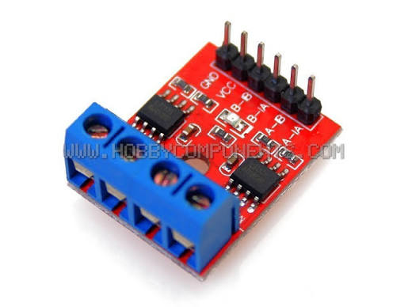
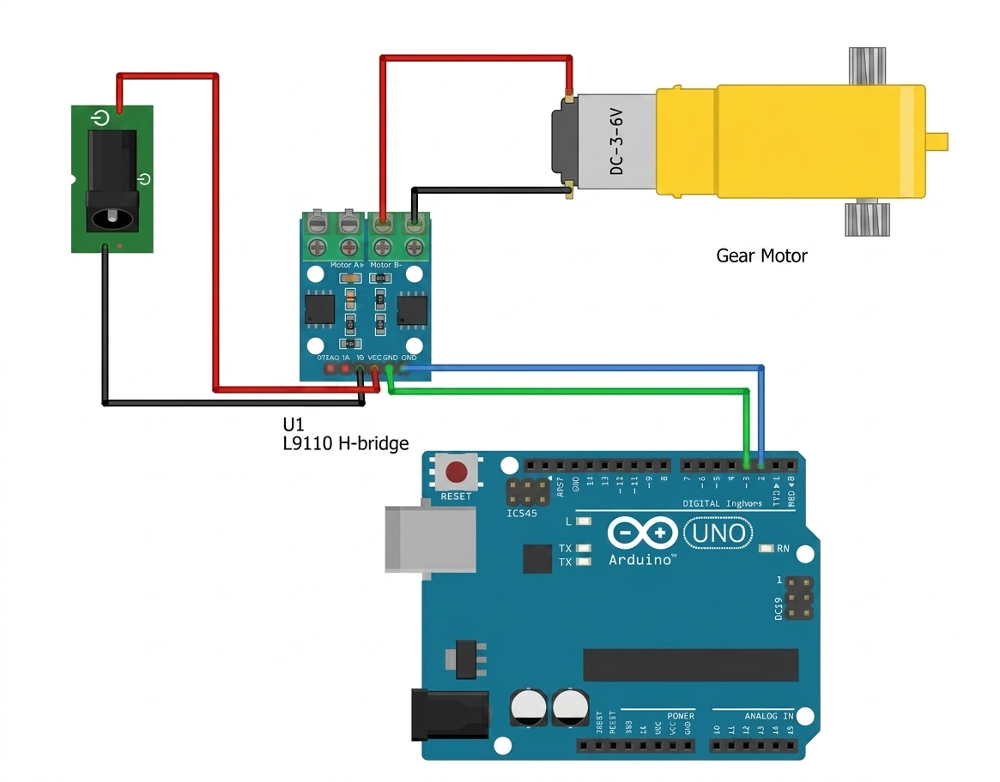

# 🛠️ دليل الأردوينو العملي: تحريك المحركات باستخدام مشغّل المحركات L9110S

---

## 📌 مقدمة: مرحباً بكم في درس اليوم 🚀

في الدروس السابقة، تعلمنا كيف نحرّك ذراعاً بدقّة باستخدام **محرك السيرفو**، وكيف نتحكم في **شدة الإضاءة** عبر تقنية PWM، وكيف نقرأ **الحرارة** والبيئة من حولنا.  
لكن، هل لاحظتم شيئاً؟ الأردوينو وحده **لا يستطيع** تشغيل محرك كبير (مثل مروحة أو عجلة سيارة) مباشرةً! لو حاولنا توصيل المحرك على الرجل مباشرةً، قد يحترق الأردوينو لأن المحرك يحتاج تياراً أكبر بكثير مما تستطيع اللوحة إعطاءه.

لذلك، اليوم سنتعلّم استخدام **مشغّل المحركات L9110S** (Motor Driver)، وهي مثل "مضخّم قوي" يتلقى أوامر صغيرة من الأردوينو ويترجمها إلى طاقة حقيقية تدير المحرك: للأمام، للخلف، وبسرعات مختلفة!

خطتنا في هذا الدرس ستكون على أربع مراحل:
1. **المرحلة الأولى:** فهم ماذا تفعل مشغّل المحركات L9110S ولماذا نحتاجها.
2. **المرحلة الثانية:** تدوير المحرك للأمام والخلف بأوامر نصية من الكمبيوتر.
3. **المرحلة الثالثة:** التحكم في **سرعة** المحرك عبر تقنية PWM.
4. **المرحلة الرابعة:** بناء "سيارة تتجنّب الحائط" بدمج هذا الدرس مع مستشعر المسافة.

---

## 🧠 الجزء الأول: ما هي مشغّل المحركات L9110S؟

تخيل الأردوينو كعقل صغير يفكّر ويأمر، ومشغّل المحركات L9110S كـ **عضلات قوية** تسمع الأمر وتنفّذه. المشغّل يحتوي على دائرة ذكية اسمها **دائرة عكس التيار** تسمح بتمرير التيار للمحرك في اتجاهين متعاكسين.



### لماذا لا نوصّل المحرك مباشرة؟ 🤔
- المحرك يسحب تياراً كبيراً قد يحرق الأردوينو.
- المحرك يحتاج جهداً أعلى (مثل 5V أو أكثر من بطارية) بينما الأردوينو يعطي إشارات تحكّم فقط.
- المشغّل يحمي الأردوينو وتسمح بعكس اتجاه الدوران بسهولة.

### أرجل المشغّل (Pinout):
معظم بطاقات L9110S تحتوي على **قناتين (A و B)**، كل قناة تدير محركاً واحداً. سنستخدم **القناة A** في هذا الدرس:

| الرجل | الوظيفة |
| ----- | ------- |
| **VCC** | مصدر طاقة المحرك (5V أو بطارية) |
| **GND** | التربة (تُربط مع GND الأردوينو) |
| **A-IA** | رجل تحكّم 1 للمحرك A (نوصّله بـ Pin في الأردوينو) |
| **A-IB** | رجل تحكّم 2 للمحرك A (نوصّله بـ Pin آخر) |
| **A01 / A02** | طرفي توصيل المحرك A |

> 💡 **مفهوم مهم (دائرة عكس التيار):**  
> عند إعطاء `A-IA = HIGH` و `A-IB = LOW` يمر التيار باتجاه فيدور المحرك للأمام.  
> عند عكسهما `A-IA = LOW` و `A-IB = HIGH` يمر التيار بالعكس فيدور للخلف.  
> عند جعلهما كلاهما `LOW` يتوقف المحرك. بسيط أليس كذلك؟

---

## 💻 الجزء الثاني: تدوير المحرك للأمام والخلف (Serial Control)

كما فعلنا في درس السيرفو، سنرسل أوامر نصية من الكمبيوتر لنجرّب اتجاهات المحرك قبل التحكم الحقيقي.

### 📌 التوصيل:
| مكوّنات المشغّل | التوصيل في الأردوينو |
| ------------- | -------------------- |
| **VCC** | **5V** (أو بطارية خارجية للمحركات الكبيرة) |
| **GND** | **GND** |
| **A-IA** | **الرجل 9** (يدعم PWM) |
| **A-IB** | **الرجل 8** |
| **A01** | طرف المحرك (+) |
| **A02** | طرف المحرك (−) |

> ⚠️ **تنبيه:** إن كان المحرك كبيراً، لا تغذّه من 5V الأردوينو! استخدم بطارية خارجية واربط **GND** المشترك بين البطارية والأردوينو.



### 📝 الكود:
```cpp
/*
 * مشروع: التحكم باتجاه محرك DC عبر رسائل نصية
 * F = للأمام، B = للخلف، S = توقف
 * نستخدم متغيراً (motorState) لحفظ حالة المحرك الحالية،
 * فلا نعيد إصدار الأوامر كل دورة، ونمرّ بتوقف قصير عند عكس الاتجاه.
 */

int motorIA = 9;  // A-IA
int motorIB = 8;  // A-IB

// حالة المحرك: 1 = أمام، -1 = خلف، 0 = توقف
int motorState = 0;

void setMotor(int state) {
  // لو كنا ندور ثم طُلب الاتجاه المعاكس، نمرّ بحالة توقف قصيرة أولاً
  if (state != motorState && state != 0 && motorState != 0) {
    digitalWrite(motorIA, LOW);
    digitalWrite(motorIB, LOW);
    delay(100);
  }
  motorState = state;

  if (state == 1) {            // أمام
    digitalWrite(motorIA, HIGH);
    digitalWrite(motorIB, LOW);
  } else if (state == -1) {    // خلف
    digitalWrite(motorIA, LOW);
    digitalWrite(motorIB, HIGH);
  } else {                     // توقف
    digitalWrite(motorIA, LOW);
    digitalWrite(motorIB, LOW);
  }
}

void setup() {
  pinMode(motorIA, OUTPUT);
  pinMode(motorIB, OUTPUT);
  setMotor(0);                 // نبدأ متوقفين
  Serial.begin(9600);
  Serial.println("اكتب F (أمام) أو B (خلف) أو S (توقف):");
}

void loop() {
  if (Serial.available() > 0) {
    char cmd = Serial.read();

    if (cmd == 'F') {
      setMotor(1);
      Serial.println("المحرك يدور للأمام ⏩");
    }
    else if (cmd == 'B') {
      setMotor(-1);
      Serial.println("المحرك يدور للخلف ⏪");
    }
    else if (cmd == 'S') {
      setMotor(0);
      Serial.println("توقف ⏹️");
    }
  }
}
```
**التطبيق:** افتح **Serial Monitor**، اكتب `F` واضغط Enter فراقب المحرك يدور، ثم `B` لعكس الاتجاه و `S` للتوقف.

---

## ⚡ الجزء الثالث: التحكم في سرعة المحرك (PWM)

المحرك يدور الآن، لكن دائماً بأقصى سرعة! كما تعلمنا في درس المقاومة المتغيرة، نستخدم تقنية **PWM** لضبط السرعة عبر دالة `analogWrite` (قيم من 0 إلى 255).

### 🧩 الفكرة البرمجية:
للأمام بسرعة معيّنة: نضع `analogWrite` على `A-IA` ونثبّت `A-IB` على `LOW`.  
للخلف: نثبّت `A-IA` على `LOW` ونضع `analogWrite` على `A-IB`.

### 📝 الكود:
```cpp
/*
 * مشروع: التحكم بسرعة واتجاه محرك DC
 * أرسل رقماً موجباً (0..255) للأمام، أو سالباً للخلف
 * نحفظ الحالة والسرعة في متغيرات لنحرّك المحرك بشكل آمن.
 */

int motorIA = 9;  // A-IA (PWM)
int motorIB = 8;  // A-IB

int motorState = 0;   // 1 أمام، -1 خلف، 0 توقف
int motorSpeed = 0;   // 0..255

void setMotor(int state, int speed) {
  // توقف قصير عند تبديل الاتجاه لحماية المحرك
  if (state != motorState && state != 0 && motorState != 0) {
    digitalWrite(motorIA, LOW);
    digitalWrite(motorIB, LOW);
    delay(100);
  }
  motorState = state;
  motorSpeed = constrain(speed, 0, 255);

  if (state == 1) {
    analogWrite(motorIA, motorSpeed);
    digitalWrite(motorIB, LOW);
  } else if (state == -1) {
    digitalWrite(motorIA, LOW);
    analogWrite(motorIB, motorSpeed);
  } else {
    digitalWrite(motorIA, LOW);
    digitalWrite(motorIB, LOW);
  }
}

void setup() {
  pinMode(motorIA, OUTPUT);
  pinMode(motorIB, OUTPUT);
  setMotor(0, 0);
  Serial.begin(9600);
  Serial.println("اكتب رقماً للأمام (0..255)، أو سالباً للخلف:");
}

void loop() {
  if (Serial.available() > 0) {
    int value = Serial.parseInt();

    if (value >= -255 && value <= 255) {
      if (value >= 0) setMotor(1, value);
      else            setMotor(-1, -value);
      Serial.print("الحالة/السرعة: ");
      Serial.println(value);
    } else {
      Serial.println("خطأ: القيمة يجب أن تكون بين -255 و 255");
    }
  }
}
```
> 🛠️ **التجربة:** جرّب القيمة `80` ثم `255` ولاحظ الفرق في قوة الدوران. القيمة `0` تعني توقف تام.

---

## 🚗 الجزء الرابع: بناء سيارة تتجنّب الحائط (تحدّي شامل)

بما أننا نستطيع الآن تحريك المحرك للأمام/للخلف وبسرعات مختلفة، فلنجمع هذا الدرس مع **مستشعر المسافة** (إن توفّر) أو ببساطة مع **الزر** لبناء سلوك ذكي.

### الفكرة:
- المحرك يدور للأمام بشكل افتراضي.
- عند الضغط على زر (أو اقتراب حائط) → يتوقف ثم يدور للخلف قليلاً.

### 📝 الكود (مع زر بسيط على الرجل 10):
```cpp
/*
 * مشروع: محرك يتفاعل مع زر (مثل تجنّب حائط)
 * نستخدم motorState لمعرفة الحالة الحالية،
 * فلا نعيد إصدار الأوامر كل دورة بل فقط عند تغيّر الحالة.
 */

int motorIA = 9;
int motorIB = 8;
int btnPin  = 10;

int motorState = 1;   // نبدأ بالتقدّم للأمام

void setMotor(int state) {
  // توقف قصير عند تبديل الاتجاه
  if (state != motorState && state != 0 && motorState != 0) {
    digitalWrite(motorIA, LOW);
    digitalWrite(motorIB, LOW);
    delay(100);
  }
  motorState = state;

  if (state == 1) {
    digitalWrite(motorIA, HIGH);
    digitalWrite(motorIB, LOW);
  } else if (state == -1) {
    digitalWrite(motorIA, LOW);
    digitalWrite(motorIB, HIGH);
  } else {
    digitalWrite(motorIA, LOW);
    digitalWrite(motorIB, LOW);
  }
}

void setup() {
  pinMode(motorIA, OUTPUT);
  pinMode(motorIB, OUTPUT);
  pinMode(btnPin, INPUT);
  setMotor(1);   // تقدّم للأمام في البداية
}

void loop() {
  if (digitalRead(btnPin) == HIGH) {
    if (motorState != -1) setMotor(-1);   // ابتعد للخلف مرة واحدة فقط
  } else {
    if (motorState != 1) setMotor(1);     // عُد للأمام عند تحرير الزر
  }
}
```

---

## 🏋️‍♂️ تمارين وتحديات تطبيقية

### 🎯 التمرين الأول: سيارة حقيقية بمحركين 🚙
**المطلوب:** استخدم **القناة B** (B-IA و B-IB) للمحرك الثاني كما فعلت مع القناة A.  
**الفكرة:** بتحريك المحركين بسرعات مختلفة يمكنك جعل "السيارة" تدور يميناً أو يساراً (مثل الروبوتات الحقيقية).

### 🎯 التمرين الثاني: تحكم بالسرعة عبر المقاومة المتغيرة 🎚️
**المطلوب:** ادمج درس **المقاومة المتغيرة**! اقرأ قيمة الـ Potentiometer (0–1023) وحوّلها بـ `map()` إلى سرعة (0–255) لتتحكم في سرعة المحرك يدوياً.

### 🎯 التمرين الثالث: سيارة ذكية بتجنّب الحوائط 🤖
**المطلوب:** استخدم **مستشعر المسافة HC-SR04** لقياس المسافة، وإذا اقترب جدار عن مسافة معيّنة سيقوم المحرك بالتوقف والرجوع للخلف تلقائياً (بدون زر!).

---

## 📝 ملخص الدرس

| النقطة | الشرح |
| --- | --- |
| **مشغّل المحركات L9110S** | مشغّل (Motor Driver) يحمي الأردوينو ويغذّي المحرك بتيار كافٍ. |
| **دائرة عكس التيار** | دائرة تسمح بعكس اتجاه التيار فتجعل المحرك يدور للأمام أو الخلف. |
| **الاتجاه** | `IA=HIGH, IB=LOW` → أمام؛ `IA=LOW, IB=HIGH` → خلف؛ كلاهما `LOW` → توقف. |
| **حفظ الحالة** | متغير `motorState` يتبّع حالة المحرك (أمام/خلف/توقف) ويمنع تكرار الأوامر ويحميه عند العكس. |
| **السرعة (PWM)** | `analogWrite` بقيمة من 0 إلى 255 على أحد الرجلين لتخفيف/زيادة السرعة. |
| **الطاقة** | يُفضّل بطارية خارجية للمحركات الكبيرة مع ربط GND المشترك. |

---

## 🎓 حقائق علمية ومهنية!

- 🚀 بدون مشغّلات المحركات هذه، لن تعمل الروبوتات والطائرات المسيّرة (Drones)؛ كل عجلة وكل مروحة تحتاج "عضلات" مثل L9110S أو أشقائها الأقوى (مثل L298N).
- 🔋 المحرك عند بدء الدوران يسحب تياراً "اندفاعياً" عالياً جداً للحظة، لذلك دائماً نربط GND المشترك ونستخدم مصدر طاقة مناسب لتجنّب إعادة تشغيل الأردوينو فجأة.
- 🤖 في السيارات ذاتية القيادة، تُستخدم مشغّلات مشابهة للتحكم في عجلات القيادة والفرامل، لكن بقوة وأمان أعلى بكثير!

---

> 🚀 **أحسنتم!** لقد تحول الأردوينو الآن من "مفكّر صغير" إلى "قائد آلة" يحرّك المحركات ويوجّه السيارات! جرّبوا دمج هذا الدرس مع ما سبق لبناء مشاريعكم الخاصة. بالتوفيق في المعمل! ⚡💻🔧
