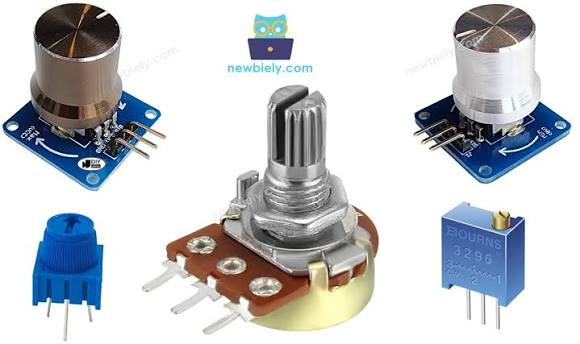
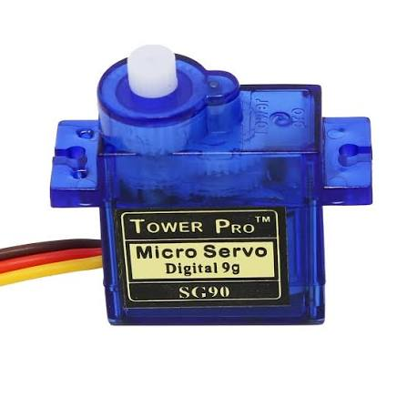
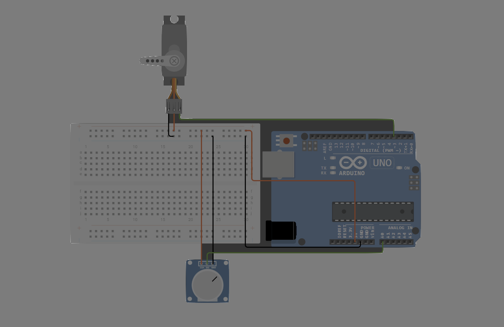

# 🛠️ دليل الأردوينو العملي: التحكم الدقيق باستخدام المقاومة المتغيرة ومحرك السيرفو

---

## 📌 مقدمة: مرحباً بكم في درس اليوم 🚀

في الدروس السابقة، تعلمنا كيفية استخدام الأزرار، والتي تعطي إشارة إما تشغيل (1) أو إطفاء (0).  
اليوم، سننتقل إلى مستوى متقدم من التحكم؛ سنتعلم كيف نتحكم في المكونات الإلكترونية **بدرجات متفاوتة ومحددة بدقة** (مثل التحكم التدريجي في شدة إضاءة لمبة أو زاوية دوران محرك).

خطتنا في هذا الدرس ستكون على أربع مراحل:
1. **المرحلة الأولى:** فهم طبيعة وآلية عمل المقاومة المتغيرة.
2. **المرحلة الثانية:** التحكم بشدة إضاءة الـ LED عن طريق إرسال أوامر رقمية من الكمبيوتر.
3. **المرحلة الثالثة:** استبدال أوامر الكمبيوتر بالمقاومة المتغيرة للتحكم الفعلي بالإضاءة.
4. **المرحلة الرابعة:** استخدام المقاومة المتغيرة للتحكم في حركة محرك السيرفو (Servo Motor).

---

## 🧠 الجزء الأول: ما هي المقاومة المتغيرة (Potentiometer)؟

تخيل المفتاح الدوّار الذي تستخدمه للتحكم في مستوى الصوت في الراديو، أو لضبط مستوى إضاءة غرفتك.. هذا المفتاح هو في الحقيقة **مقاومة متغيرة**.



### كيف تعمل؟ 🤔
كما تعلمنا سابقاً، وظيفة المقاومة هي تقليل مرور التيار الكهربائي. ولكن في **المقاومة المتغيرة**، يمكنك تغيير قيمة هذه المقاومة يدوياً عبر لف المفتاح:
- عند لف المفتاح باتجاه أحد الأطراف (مثلاً أقصى اليسار): تكون قيمة المقاومة في أعلى مستوياتها، فلا يمر التيار (القراءة 0).
- عند لف المفتاح للطرف الآخر (أقصى اليمين): تنعدم قيمة المقاومة تقريباً، فيمر التيار بالكامل (القراءة القصوى 1023).

### شكلها وأرجلها:
تحتوي هذه القطعة على **3 أرجل**:
1. **الرجل الأولى (VCC):** تُوصل بمصدر الطاقة (5V).
2. **الرجل الثانية (الوسطى):** وهي الرجل الأهم، تُوصل بأحد الأرجل التماثلية (Analog) في الأردوينو (مثل A0). هذه الرجل هي التي تقرأ التغيير في قيمة المقاومة.
3. **الرجل الثالثة (GND):** تُوصل بالطرف السالب (GND).

> 💡 **مفهوم مهم: الإشارات التماثلية (Analog):**  
> الأزرار تعطي إشارات رقمية (Digital): إما `0` أو `1` فقط.  
> أما المقاومة المتغيرة فتعطي إشارات تماثلية (Analog): تتراوح قيمتها بين `0` و `1023` (أي أنها توفر 1024 درجة قراءة مختلفة)، مما يمنحنا تحكماً دقيقاً جداً.

---

## 💻 الجزء الثاني: التحكم بشدة إضاءة الـ LED عبر المنفذ التسلسلي (Serial Control)

قبل أن نربط المقاومة المتغيرة، يجب أن نفهم أولاً كيف نتحكم في "شدة" إضاءة اللمبة برمجياً باستخدام الكمبيوتر.  
تقنية التحكم في شدة الإضاءة تُعرف بـ **PWM** (التعديل بعرض النبضة - Pulse Width Modulation). هذه التقنية تعتمد على فتح وإغلاق الدائرة الكهربائية بسرعة عالية جداً، مما يسمح لنا بالتحكم الفعلي في شدة الإضاءة التي تتراوح قيمتها بين 0 (مطفأة) و 255 (إضاءة قصوى).

### 📌 التوصيل:
وصّل الطرف الموجب للـ LED بـ **الرجل 9** (لأن الرجل 9 يدعم تقنية PWM)، والطرف السالب بمقاومة 220Ω ثم بـ GND.

### 📝 الكود:
```cpp
/*
 * مشروع: التحكم بشدة إضاءة اللمبة عبر الرسائل النصية
 * نرسل قيمة رقمية من 0 إلى 255 من شاشة الكمبيوتر
 */

int ledPin = 9; // الرجل 9 يدعم التحكم بشدة الإضاءة (PWM)

void setup() {
  pinMode(ledPin, OUTPUT);
  Serial.begin(9600); // فتح خط التواصل مع الكمبيوتر
  Serial.println("أدخل رقماً بين 0 و 255 للتحكم بشدة الإضاءة:");
}

void loop() {
  // التحقق من وجود رسالة جديدة من الكمبيوتر
  if (Serial.available() > 0) {
    // قراءة الرقم المُدخل
    int brightness = Serial.parseInt();
    
    // التأكد من أن الرقم ضمن النطاق المسموح
    if (brightness >= 0 && brightness <= 255) {
      analogWrite(ledPin, brightness); // تطبيق شدة الإضاءة
      Serial.print("تم ضبط شدة الإضاءة على: ");
      Serial.println(brightness);
    } else {
      Serial.println("خطأ: القيمة المدخلة يجب أن تكون بين 0 و 255");
    }
  }
}
```
**التطبيق:** افتح نافذة **Serial Monitor** في برنامج الأردوينو، أدخل الرقم `50` واضغط Enter، ثم جرّب الرقم `200` ولاحظ الفرق في شدة الإضاءة.

---

## ⚡ الجزء الثالث: ربط المقاومة المتغيرة للتحكم بالـ LED

الآن سننتقل من التحكم الافتراضي (عبر الكمبيوتر) إلى التحكم العملي (عبر المقاومة المتغيرة).

### 📌 التوصيل:
1. **المقاومة المتغيرة:**  
   - الرجل اليمنى → `5V`  
   - الرجل الوسطى → `A0`  
   - الرجل اليسرى → `GND`  
2. **الـ LED:** يبقى موصولاً بـ **الرجل 9** كما في التجربة السابقة.

### 🧩 مشكلة التحويل بين النطاقات
المقاومة المتغيرة تعطي الأردوينو قراءات من `0 إلى 1023`.  
أما دالة التحكم بالإضاءة `analogWrite` فتقبل أرقاماً من `0 إلى 255` فقط.  
إذا استخدمنا القراءة مباشرة من المقاومة، سنحصل على نتائج غير صحيحة.  
الحل البرمجي هو استخدام دالة التحويل **`map()`**.

### 📝 الكود:
```cpp
/*
 * مشروع: التحكم بشدة الإضاءة باستخدام المقاومة المتغيرة
 */

int potPin = A0;    // رجل المقاومة المتغيرة
int ledPin = 9;     // رجل اللمبة

void setup() {
  pinMode(ledPin, OUTPUT);
  // الأرجل التماثلية (مثل A0) لا تحتاج إلى تعريف كـ INPUT افتراضياً
}

void loop() {
  // 1. قراءة القيمة الحالية للمقاومة المتغيرة (من 0 إلى 1023)
  int potValue = analogRead(potPin);
  
  // 2. تحويل القيمة من نطاق (0-1023) لتتناسب مع نطاق الإضاءة (0-255)
  int brightness = map(potValue, 0, 1023, 0, 255);
  
  // 3. تطبيق شدة الإضاءة على اللمبة
  analogWrite(ledPin, brightness);
  
  // (اختياري) طباعة القيمة على شاشة الكمبيوتر للمتابعة
  // Serial.println(brightness);
  // delay(50);
}
```
> 🛠️ **التجربة:** قم بلف مفتاح المقاومة المتغيرة ببطء من أقصى اليسار إلى أقصى اليمين، ولاحظ كيف تتغير شدة إضاءة اللمبة بشكل تدريجي ودقيق. أنت الآن قمت ببناء دائرة تحكم في الإضاءة (Dimmer).

---

## 🦾 الجزء الرابع: التحكم في حركة محرك السيرفو (Servo Motor)

بما أننا أصبحنا قادرين على قراءة المقاومة المتغيرة واستخراج قيم دقيقة منها، سنستخدم هذه القيم الآن للتحكم في حركة ميكانيكية دقيقة عبر **محرك السيرفو**.

### ما هو محرك السيرفو؟ 🤖
المحركات العادية تدور بشكل مستمر ولا تتوقف عند زاوية معينة. أما **محرك السيرفو** فهو محرك ذكي مصمم للوصول إلى زوايا محددة بدقة والثبات عليها.  
يُستخدم في التطبيقات التي تتطلب دقة مثل: أذرع الروبوت، الموجهات (الستيرنج) في السيارات ذات التحكم عن بعد، والأنظمة الصناعية.



### 📌 التوصيل:
> ⚠️ **تنبيه:** لضمان عمل الدائرة بشكل صحيح، قم بفصل الـ LED والمقاومة 220Ω من الرجل 9 قبل ربط المحرك.

تحتوي وصلة الـ Servo على 3 أسلاك ملونة:
| لون السلك | الوظيفة | مكان التوصيل في الأردوينو |
|:---:|:---|:---|
| **أحمر** | الطاقة الموجبة (VCC) | **5V** |
| **بني/أسود** | الطرف السالب (GND) | **GND** |
| **أصفر/برتقالي** | إشارة التحكم (Signal) | **الرجل 9** |

*(المقاومة المتغيرة تبقى موصلة كما هي على A0، 5V، و GND).*



### 📝 الكود:
```cpp
/*
 * مشروع: التحكم بمحرك السيرفو باستخدام المقاومة المتغيرة
 * سنستخدم مكتبة جاهزة لتسهيل التعامل مع المحرك
 */

#include <Servo.h> // استدعاء مكتبة السيرفو

Servo myServo;     // تعريف كائن يمثل المحرك
int potPin = A0;   // رجل المقاومة المتغيرة

void setup() {
  // ربط المحرك بالرجل 9
  myServo.attach(9); 
}

void loop() {
  // 1. قراءة قيمة المقاومة المتغيرة (من 0 إلى 1023)
  int potValue = analogRead(potPin);
  
  // 2. تحويل القيمة لتناسب زوايا السيرفو
  // محرك السيرفو يعمل عادة على زوايا من 0 إلى 180 درجة
  int angle = map(potValue, 0, 1023, 0, 180);
  
  // 3. إرسال الأمر للمحرك بالتحرك إلى الزاوية المحسوبة
  myServo.write(angle);
  
  // إعطاء المحرك وقتاً قصيراً للانتقال للزاوية الجديدة بسلاسة
  delay(15); 
}
```
**نتيجة العمل:** عند لف مفتاح المقاومة المتغيرة، سيتحرك ذراع المحرك تبعاً لحركتك بدقة ويتوقف فور توقفك عن اللف.

---

## 🏋️‍♂️ تمارين وتحديات تطبيقية

### 🎯 التمرين الأول: قفل إلكتروني بمحرك 🔒
**المطلوب:** دمج مفهوم الرسائل النصية (الجزء الثاني) مع محرك السيرفو (الجزء الرابع).  
**فكرة البرنامج:** افتح نافذة Serial، إذا أدخل المستخدم الرقم `1234` يتحرك السيرفو إلى زاوية 90 درجة (يمثل فتح الباب)، وإذا أدخل أي رقم آخر يعود السيرفو إلى زاوية 0 درجة (إغلاق الباب).

### 🎯 التمرين الثاني: التحكم بسرعة الوميض ⏱️
**المطلوب:** أعد توصيل الـ LED على رجل آخر (مثلاً الرجل 10).  
**فكرة البرنامج:** بدلاً من استخدام المقاومة المتغيرة للتحكم في *شدة* الإضاءة، استخدمها للتحكم في *سرعة* الوميض (Blink). لف المقاومة لليمين فيزداد معدل الوميض بسرعة، ولفها لليسار فيصبح الوميض بطيئاً جداً. *(تلميح: استخدم قيمة المقاومة المتغيرة كمدخل لدالة `delay()`).*

---

## 📝 ملخص الدرس

| النقطة | الشرح |
|---|---|
| **المقاومة المتغيرة (Potentiometer)** | مقاومة يمكن تغيير قيمتها يدوياً، تعطي الأردوينو قراءات تماثلية بين 0 و 1023. |
| **التحكم بـ PWM** | تقنية إلكترونية للتحكم في شدة الإضاءة أو سرعة المحركات عبر إشارات تتراوح بين 0 و 255. |
| **دالة التحويل `map()`** | دالة برمجية تقوم بتحويل القيم من نطاق معين (مثل 0-1023) إلى نطاق آخر (مثل 0-255 أو 0-180). |
| **محرك السيرفو (Servo)** | محرك دقيق يتحرك ويتوقف عند زوايا محددة (غالباً من 0 إلى 180 درجة). |
| **المكتبات (Libraries)** | أكواد برمجية مكتوبة مسبقاً (مثل `Servo.h`) يتم استدعاؤها لتسهيل البرمجة والتحكم بالمكونات المعقدة. |

---

## 🎓 حقائق علمية ومهنية!

- 🌟 تقنية الـ PWM لا تقتصر على اللمبات فقط، بل تُستخدم بشكل أساسي في التحكم بسرعة المحركات الكهربائية المختلفة، وفي توليد النغمات الصوتية عبر السماعات!
- 🦾 محرك السيرفو يحتوي داخله على دائرة إلكترونية صغيرة وعلبة تروس. على الرغم من قوته، إلا أن إجباره على الدوران يدوياً أثناء عمله قد يتسبب في تلف التروس الصغيرة داخله.
- 🎮 في أجهزة التحكم بالألعاب (مثل أجهزة PlayStation)، الأزرار التي تستجيب لقوة الضغط (مثل زر التسديد) تعتمد في الأساس على تقنية مشابهة للمقاومة المتغيرة لقراءة مدى ضغط اللاعب بدقة.

---
> 🚀 **أحسنتم!** لقد تعلمتم اليوم كيف تربطوا العالم المادي (المقاومات المتغيرة) بالتحكم البرمجي الدقيق (شدة الإضاءة، زوايا الحركة). حاولوا تطبيق ما تعلمتموه مع شاشة الأرقام السباعية (7-Segment) من الدرس الماضي لبناء نظام تحكم متكامل. بالتوفيق في المعمل! ⚡💻🔧