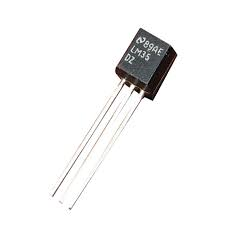
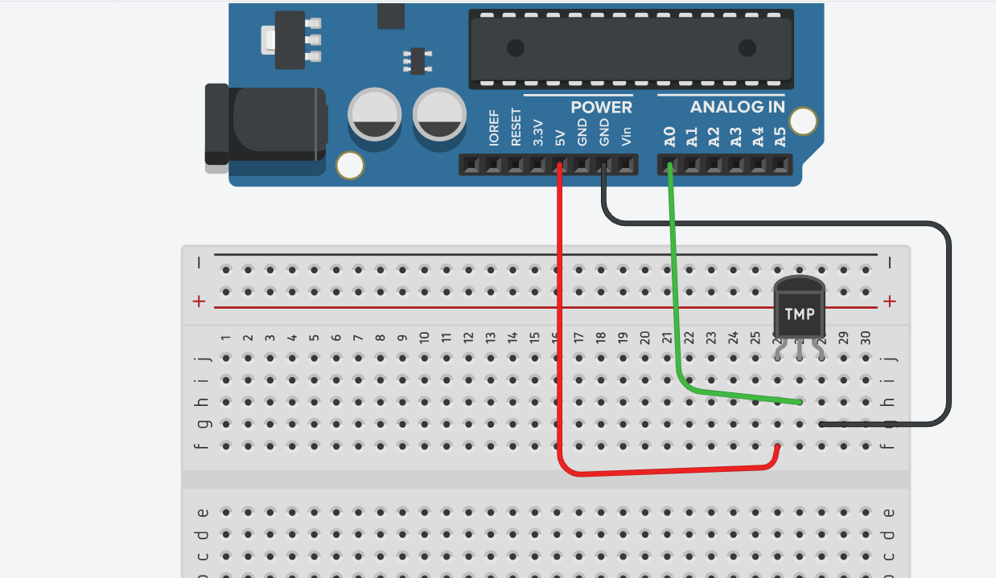

# 🛠️ دليل الأردوينو العملي: قياس درجة الحرارة باستخدام مستشعر LM35DZ وشاشة الأرقام

---

## 📌 مقدمة: مرحباً بكم في درس اليوم 🚀

في الدروس السابقة، تعلمنا كيف نقرأ الإشارات من العالم المادي يدوياً (مثل لف المقاومة المتغيرة)، وكيف نعرض الأرقام على شاشة الأرقام السباعية (7-Segment). 

اليوم، سننتقل إلى مستوى جديد من الذكاء؛ سنعلّم الأردوينو كيف **"يحس"** بالبيئة من حوله بشكل تلقائي دون تدخل الإنسان! سنستخدم مستشعر لقراءة درجة الحرارة.

خطتنا في هذا الدرس ستكون على أربع مراحل:
1. **المرحلة الأولى:** فهم طبيعة وآلية عمل مستشعر الحرارة (LM35DZ).
2. **المرحلة الثانية (المرحلة الأولى من التجربة):** قراءة الحرارة وعرضها على شاشة الكمبيوتر (Serial Monitor).
3. **المرحلة الثالثة (المرحلة الثانية من التجربة):** استبدال شاشة الكمبيوتر بشاشة الأرقام (7-Segment / 8-Segment) لنجعلها جهازاً مستقلاً.
4. **المرحلة الرابعة:** إضافة رد فعل للمستشعر (تنبيه حراري) باستخدام الـ LED.

---

## 🧠 الجزء الأول: ما هو مستشعر الحرارة (LM35DZ)؟

تخيل ميزان الحرارة الزجاجي الذي يستخدمه الأطباء، لكن بدلاً من الزئبق، نستخدم هنا إلكترونيات دقيقة لمعرفة الحرارة. قطعة الـ **LM35DZ** هي مستشعر إلكتروني دقيق جداً ومصمم خصيصاً لقراءة درجة حرارة الغرفة أو الأجهزة.


**الشكل 1:** شكل مستشعر الحرارة LM35DZ.

### كيف يعمل؟ 🤔
هذا المستشعر مذهل في بساطته؛ فهو يحول الحرارة إلى **كهرباء (جهد كهربائي)**.
قاعدته الذهبية تقول: **كل زيادة بمقدار 1 درجة مئوية (1°C)، يزيد المستشعر جهد خرجه بمقدار 10 مللي فولت (0.01 فولت).**
- إذا كانت الحرارة 20 درجة، سيُخرج المستشعر 0.20 فولت.
- إذا كانت الحرارة 35 درجة، سيُخرج المستشعر 0.35 فولت.

### شكله وأرجله:
يأتي المستشعر بشكل أسطواني صغير (شبه الترانزستور) وله **3 أرجل** (عند النظر له من الأمام حيث تكون الكتابة مواجهة لك):
1. **الرجل اليسرى (VCC):** تُوصل بمصدر الطاقة (5V).
2. **الرجل الوسطى (Vout):** وهي الرجل الأهم، تُوصل بأحد الأرجل التماثلية في الأردوينو (مثل **A0**) لقراءة التغير في الجهد.
3. **الرجل اليمنى (GND):** تُوصل بالطرف السالب (GND).

> 💡 **ملاحظة هامة:** لا تخلط بين الأرجل أبداً! توصيل الطاقة بالرجل الوسطى قد يؤدي إلى حرق المستشعر فوراً.

---

## 💻 الجزء الثاني: قراءة الحرارة وعرضها على الكمبيوتر (Phase 1)

في هذه المرحلة، سنقوم بقراءة الجهد القادم من المستشعر باستخدام دالة `analogRead()`، ثم سنقوم بتحويل هذا الجهد إلى أرقام حقيقية تمثل درجة الحرارة.

### 📌 التوصيل:
- الرجل اليسرى (VCC) ← **5V**
- الرجل الوسطى (Vout) ← **A0**
- الرجل اليمنى (GND) ← **GND**


**الشكل 2:** توصيل مستشعر الحرارة LM35 بالأردوينو.

### 🧩 معادلة التحويل
كما نعلم، الأردوينو يقرأ الجهد على شكل أرقام من `0 إلى 1023`. 
لتحويل هذا الرقم إلى حرارة حقيقية، المبرمجون المحترفون يستخدمون معادلة ذكية لتجنب الكسور المعقدة، وهي:
**الحرارة = (القراءة × 500) ÷ 1024**
*(هذه المعادلة تقوم بحساب الفولت ثم ضربه في 100 لتحويله لدرجة مئوية بخطوة واحدة).*

### 📝 الكود:
```cpp
/*
 * مشروع: مقياس الحرارة الإلكتروني - المرحلة الأولى
 * عرض درجة الحرارة على شاشة الكمبيوتر
 */

int tempPin = A0; // رجل المستشعر

void setup() {
  Serial.begin(9600); // فتح خط التواصل مع الكمبيوتر
  Serial.println("جاري تشغيل مقياس الحرارة...");
}

void loop() {
  // 1. قراءة القيمة الخام من المستشعر (من 0 إلى 1023)
  int rawValue = analogRead(tempPin);
  
  // 2. تطبيق معادلة التحويل لإيجاد الحرارة الحقيقية
  // نستخدم (float) لكي نحصل على أرقام عشرية (مثل 25.5 درجة)
  float tempC = (rawValue * 500.0) / 1024.0;
  
  // 3. طباعة النتيجة على شاشة الكمبيوتر
  Serial.print("درجة الحرارة الآن هي: ");
  Serial.print(tempC);
  Serial.println(" درجة مئوية.");
  
  delay(1000); // انتظار ثانية واحدة قبل القراءة التالية
}
```
**التطبيق:** افتح نافذة **Serial Monitor**، واضغط على زر الـ Reset في الأردوينو. حاول الإمساك بالمستشعر بأصابعك برفق، ولاحظ كيف ترتفع درجة الحرارة الرقمية تدريجياً على الشاشة!

---

## ⚡ الجزء الثالث: عرض الحرارة على شاشة الأرقام (Phase 2)

الآن سنستغني عن الكمبيوتر! سنأخذ نفس الرقم الذي حصلنا عليه في المرحلة الأولى، ونعرضه على شاشة الأرقام السباعية (والتي تُعرف أحياناً بـ 8-segment إذا كانت تحتوي على نقطة عشرية) كما تعلمنا في الدرس السابق.

### 📌 التوصيل:
1. أبقِ توصيلات المستشعر (LM35) كما هي على `A0`.
2. قم بتوصيل شاشة الأرقام (7-Segment) كما فعلت في الدرس الماضي (باستخدام الـ Resistors أو الـ Shift Register 74HC595 على الأرجل من 2 إلى 8 مثلاً).

### 🧩 التحدي البرمجي
شاشة الـ 7-Segment لا تفهم الكسور (لا تستطيع عرض 25.5)، لذا سنستخدم الأعداد الصحيحة (Integers) فقط. سنعيد كتابة دالة التحويل لتعطينا رقماً صحيحاً بسيطاً، ثم نمرره على مصفوفة الأرقام التي تعلمناها سابقاً.

### 📝 الكود:
```cpp
/*
 * مشروع: مقياس الحرارة الرقمي المستقل - المرحلة الثانية
 * عرض الحرارة على شاشة 7-segment
 */

// تعريف أرجل الشاشة (حسب توصيلك السابق، هذا مجرد مثال)
int segmentPins[] = {2, 3, 4, 5, 6, 7, 8}; // a, b, c, d, e, f, g

// مصفوفة أشكال الأرقام من 0 إلى 9 (كما تعلمنا سابقاً)
byte digits[10][7] = {
  {1,1,1,1,1,1,0}, // 0
  {0,1,1,0,0,0,0}, // 1
  {1,1,0,1,1,0,1}, // 2
  {1,1,1,1,0,0,1}, // 3
  {0,1,1,0,0,1,1}, // 4
  {1,0,1,1,0,1,1}, // 5
  {1,0,1,1,1,1,1}, // 6
  {1,1,1,0,0,0,0}, // 7
  {1,1,1,1,1,1,1}, // 8
  {1,1,1,1,0,1,1}  // 9
};

int tempPin = A0;

void setup() {
  // تعريف أرجل الشاشة كمخارج
  for (int i = 0; i < 7; i++) {
    pinMode(segmentPins[i], OUTPUT);
  }
}

void loop() {
  // 1. قراءة المستشعر وتحويله إلى رقم صحيح (بدون كسور)
  int rawValue = analogRead(tempPin);
  // استخدام الأرقام الصحيحة (int) بدلاً من العشرية (float)
  int tempC = (rawValue * 500) / 1024; 
  
  // 2. استخراج الرقم الآحاد والمراتب العشرية (إذا كانت الشاشة تعرض رقمين)
  // مثال: إذا كانت الحرارة 25، نريد عرض 5 ثم 2
  int ones = tempC % 10;         // الآحاد (5)
  int tens = (tempC / 10) % 10;  // العشرات (2)
  
  // --- ملاحظة: إذا كانت شاشتك تعرض رقم واحد فقط، استخدم هذا الكود البسيط ---
  displayNumber(ones); 
  delay(500);
  
  /* 
  // --- (اختياري) إذا كانت شاشتك من رقمين وتستخدم التعدد Multiplexing، استخدم هذا الكود ---
  displayNumber(tens);
  delay(5);
  displayNumber(ones);
  delay(5);
  */
}

// دالة مساعدة لعرض رقم معين على الشاشة
void displayNumber(int num) {
  for (int i = 0; i < 7; i++) {
    digitalWrite(segmentPins[i], digits[num][i]);
  }
}
```
**نتيجة العمل:** الآن لديك جهاز إلكتروني يعمل بطاقة مستقلة! يقرأ الحرارة من الغرفة ويعرضها مباشرة على الشاشة الرقمية. حاول نفخ هواء ساخن من فمك على المستشعر وراقب الرقم يتغير على الشاشة!

---

## 🚨 الجزء الرابع: إضافة رد فعل للحرارة (تنبيه حراري)

ما الفائدة من أن يحس الأردوينو بالحرارة إذا لم يقم بعمل أي شيء بناءً عليها؟ في هذه المرحلة السريعة، سنضيف لمبة (LED) حمراء تضيء إذا زادت الحرارة عن حد معين (مثلاً 30 درجة).

### 📌 التوصيل:
أضف لمبة LED حمراء موصولة بالرجل `13` (مع مقاومة 220Ω) كما تعلمنا في الدروس الأولى.

### 📝 التعديل على الكود (أضف هذا داخل دالة `loop` بعد حساب `tempC`):
```cpp
  // التحقق من الحرارة وتشغيل الإنذار
  if (tempC > 30) {
    digitalWrite(13, HIGH); // تشغيل اللمبة الحمراء (الحرارة مرتفعة!)
  } else {
    digitalWrite(13, LOW);  // إطفاء اللمبة (الحرارة طبيعية)
  }
```

---

## 🏋️‍♂️ تمارين وتحديات تطبيقية

### 🎯 التمرين الأول: نظام التبريد الذكي 🌬️
**المطلوب:** بدلاً من تشغيل لمبة ضوئية عند ارتفاع الحرارة، قم بتوصيل محرك صغير (DC Motor) أو مروحة صغيرة باستخدام ترانزستور (كما سنتعلم لاحقاً)، أو استخدم محرك السيرفو لفتح "نافذة" ورقة مقوية عندما تتجاوز الحرارة 28 درجة.

### 🎯 التمرين الثاني: بث الحرارة لجهاز آخر 📡
**المطلوب:** دمج هذا الدرس مع درس الـ **UART**! قم ببرمجة أردوينو أول لقراءة الحرارة وإرسالها عبر `Serial.write()`. وقم ببرمجة أردوينو ثانٍ لاستقبال هذه الحرارة وعرضها على شاشة 7-segment خاصة به. (لقد بنيت للتو نظام إنذار حراري لغرفتين!).

---

## 📝 ملخص الدرس

| النقطة | الشرح |
|---|---|
| **مستشعر LM35DZ** | مستشعر حرارة تناظري (Analog)، يُخرج 10 مللي فولت لكل درجة مئوية واحدة. |
| **معادلة التحويل** | لتحويل قراءة الأردوينو الخام إلى حرارة: `(القراءة × 500) / 1024`. |
| **الأرقام العشرية (Float) vs الصحيحة (Int)** | نستخدم `float` عند الحاجة لدقة بالكسور (على الكمبيوتر)، ونستخدم `int` عند العرض على شاشة 7-segment لتبسيط الكود. |
| **الشروط (If/Else)** | استخدام المستشعر لاتخاذ قرارات (مثل تشغيل إنذار إذا تجاوزت الحرارة رقماً معيناً). |

---

## 🎓 حقائق علمية ومهنية!

- 🌡️ المستشعر LM35 لا يقيس حرارة الجو فقط، بل يُستخدم بكثرة داخل الأجهزة الإلكترونية (مثل الكمبيوتر والهواتف) لقياس حرارة المعالج (CPU) لكي لا يحترق!
- 🧮 في عالم البرمجة، الأردوينو الصغير يواجه صعوبة في معالجة الأرقام العشرية (الـ Float) وتأخذ مساحة كبيرة من ذاكرته مقارنة بالأرقام الصحيحة (Int)، لذلك نلجأ لـ "حيل" رياضية مثل ضرب 500 وقسمة 1024 لتجنب الكسور.
- 🏭 في المصانع الكبرى، لا يستخدمون إنذاراً ضوئياً بسيطاً، بل يرسلون إشارة الحرارة عبر شبكات الـ UART أو الإنترنت إلى غرفة التحكم الرئيسية ليتخذ المشرفون قرار إيقاف الخط الإنتاجي.

---
> 🚀 **أحسنتم!** لقد نجحتم في تحويل الأردوينو من مجرد لوحة تحكم، إلى جهاز استشعار ذكي يقرأ البيئة من حوله ويعرضها ويتفاعل معها. أنتم الآن جاهزون للانتقال لمستشعرات أكثر إثارة مثل مستشعرات المسافة والحركة! بالتوفيق في المعمل! ⚡💻🔧