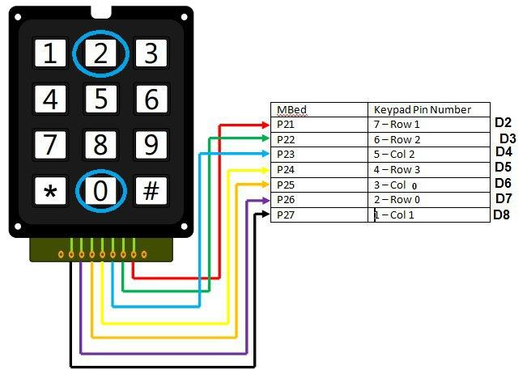
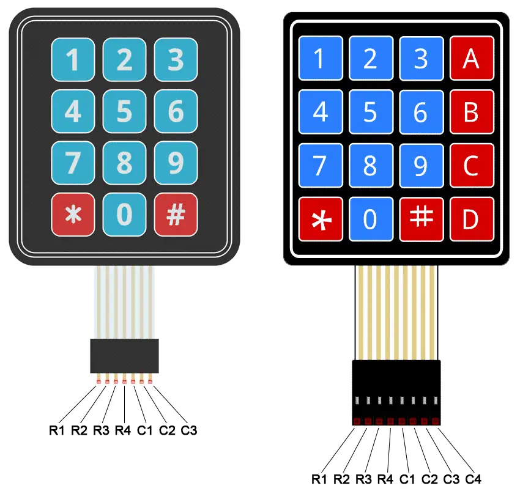
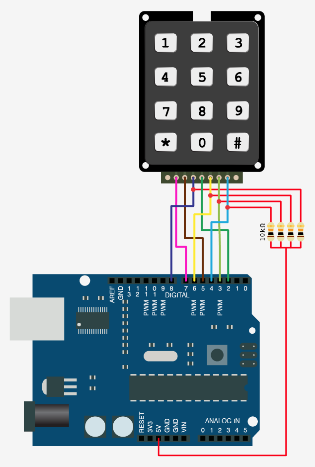
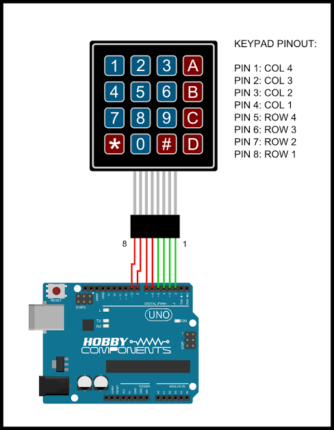

# 🛠️ دليل الأردوينو العملي: لوحة المفاتيح المصفوفية 3×4 — اثنا عشر زراً بسبعة أرجل فقط!

---

## 📌 مقدمة: مرحباً بكم في درس اليوم 🚀

في الدروس السابقة، تعلمنا كيف نقرأ **زراً واحداً** ونستقبل الأوامر من الكمبيوتر، وكيف نتحكم بالإضاءة والمحركات والحرارة، بل وتحدثنا مع أردوينو آخر عبر السلك!

لكن، هل لاحظتم شيئاً؟ كل مرة استخدمنا فيها زراً، احتاج الزر إلى **رجل كاملة** في الأردوينو. هذا مقبول لزر أو زرين.. لكن ماذا لو أردنا بناء **قفل بكلمة سر** يحتاج 12 زراً؟ أو **آلة حاسبة**؟ سنجد أن الأردوينو أونو (الذي يملك حوالي 12 رجلاً رقمية صالحة) قد نفدت أرجله قبل أن نبدأ!

اليوم سنتعلم حيلة ذكية يستخدمها المهندسون في كل مكان — من كيبورد الكمبيوتر أمامك إلى الصراف الآلي — تسمى **المصفوفة (Matrix)**: سنقرأ **12 زراً باستخدام 7 أرجل فقط**!

خطتنا في هذا الدرس ستكون على أربع مراحل:
1. **المرحلة الأولى:** فهم فكرة "المصفوفة" وكيف نحدد الزر المضغوط من تقاطع صف وعمود.
2. **المرحلة الثانية:** بناء الماسح (Scanner) بأيدينا مع مقاومات السحب للأسفل — نفس فكرة درس UART.
3. **المرحلة الثالثة:** الطريقة الاحترافية: مكتبة `Keypad` والتوصيل المباشر **بدون أي مقاومات**.
4. **المرحلة الرابعة:** مشروع ختامي: **خزنة سرية بكلمة مرور** تُفتح بمحرك السيرفو!

---

## 🧰 القطع المطلوبة

| القطعة | العدد | ملاحظة |
|--------|-------|--------|
| Arduino Uno | 1 | |
| لوحة مفاتيح مصفوفية 3×4 | 1 | أي شكل/مصنّع — انظر الشكلين 1 و2 |
| مقاومة 10KΩ | 3 | للسحب للأسفل (المرحلة الثانية فقط) |
| محرك سيرفو | 1 | قفل الخزنة في المشروع الختامي |
| LED أخضر + LED أحمر | 1 + 1 | مؤشر الصحيح/الخطأ |
| مقاومة 220Ω | 2 | للـ LED |
| Breadboard + أسلاك توصيل | - | |

---

## 🧠 الجزء الأول: ما هي لوحة المفاتيح المصفوفية (Matrix Keypad)؟

تخيل مدينة شوارعها متعامدة: شوارع **أفقية** تمتد من الشرق للغرب، وشوارع **رأسية** من الشمال للجنوب. أي بيت في المدينة يمكن تحديد عنوانه بجملة واحدة: *"تقاطع الشارع الأفقي الثاني مع الشارع الرأسي الثالث"*.

لوحة المفاتيح المصفوفية تعمل بنفس الفكرة تماماً! بدلاً من إعطاء كل زر سلكاً خاصاً به، رُتّبت الأزرار على **شبكة من الأسلاك المتقاطعة**:

```
          C1      C2      C3
          |       |       |
R1 --  [ 1 ]   [ 2 ]   [ 3 ]
          |       |       |
R2 --  [ 4 ]   [ 5 ]   [ 6 ]
          |       |       |
R3 --  [ 7 ]   [ 8 ]   [ 9 ]
          |       |       |
R4 --  [ * ]   [ 0 ]   [ # ]
```

كل زر يقع عند **تقاطع** سلك أفقي (نسميه **صف Row**) وسلك رأسي (نسميه **عمود Column**). وهنا السحر: الزر رقم `5` مثلاً ليس إلا مفتاحاً صغيراً يصل داخلياً بين السلك **R2** والسلك **C2** عندما نضغطه!


**الشكل 1:** شكل لوحة المفاتيح المصفوفية 3×4 (نموذج من أحد المصنّعين).


**الشكل 2:** نموذج آخر من مصنّع مختلف — نفس الجزء تماماً من الداخل، مع مخطط ترتيب الأرجل للنوعين 3×4 و 4×4.

> 💡 **مفهوم مهم (الحيلة الرياضية):**
> لو وصّلنا كل زر بسلك خاص، لاحتجنا **12 سلكاً** لـ 12 زراً.
> بالمصفوفة نحتاج فقط: **4 صفوف + 3 أعمدة = 7 أرجل فقط!**
> والأكثر إدهاشاً: اللوحة الأكبر 4×4 (بـ 16 زراً!) تحتاج **8 أرجل فقط**.
> كلما كبرت المصفوفة، وفّرنا أكثر — لهذا تستخدمها الكيبوردات ذات 104 أزرار!

### أرجل اللوحة:
ستلاحظ أن اللوحة تحتوي على **7 أرجل فقط**، ولا يوجد فيها **VCC ولا GND**! والسبب أنها تحتوي على أزرار فقط، والأزرار لا تحتاج طاقة بل تصل بين سلكين.

| الرجل | الوظيفة |
| ----- | ------- |
| **R1** | سلك الصف الأول (الأزرار 1، 2، 3) |
| **R2** | سلك الصف الثاني (الأزرار 4، 5، 6) |
| **R3** | سلك الصف الثالث (الأزرار 7، 8، 9) |
| **R4** | سلك الصف الرابع (الأزرار *، 0، #) |
| **C1** | سلك العمود الأول (1، 4، 7، *) |
| **C2** | سلك العمود الثاني (2، 5، 8، 0) |
| **C3** | سلك العمود الثالث (3، 6، 9، #) |

> ⚠️ **ملاحظة مهمة (اختلاف المصنّعين):**
> ترتيب الأرجل يختلف من مصنّع لآخر! في النوع الغشائي (Membrane) الشائع تكون الأرجل 1–4 هي الصفوف R1–R4 ثم الأرجل 5–7 هي الأعمدة C1–C3. **راجع دائماً مخطط أرجل لوحتك (مثل الشكل 2)**. ولو ظهرت الأزرار خاطئة على الشاشة عند التجربة، فالحل سهل جداً: بدّل الترتيب داخل جدولي `rowPins` و `colPins` في الكود — دون تغيير أي سلك!

---

## 💻 الجزء الثاني: نبني الماسح بأيدينا (مع مقاومات السحب للأسفل)

كيف يعرف الأردوينو أي زر ضُغط؟ تذكرون منادي المدرسة الذي يستدعي الطلاب **صفاً صفاً**؟ سنفعل الشيء نفسه، وتسمى هذه العملية **المسح (Scanning)**:

1. نشغّل **الصف الأول فقط** (R1) ونطفئ بقية الصفوف.
2. نقرأ الأعمدة الثلاثة: إن وجدنا عموداً "مفعّلاً"، فقد وجدنا تقاطعاً — عرفنا الصف والعمود، وبالتالي عرفنا الزر!
3. ننتقل للصف الثاني ونكرر.. وهكذا.

### 📌 التوصيل:
نجعل الصفوف **مخارج (Outputs)** من الأردوينو، والأعمدة **مداخل (Inputs)**. وكل عمود يحتاج **مقاومة 10KΩ سحب للأسفل** إلى GND — تماماً كما فعلنا مع الزر في درس UART، حتى لا تبقى الرجل "هوائياً وهمياً" يقرأ قيماً عشوائية!

| طرف لوحة المفاتيح | رجل الأردوينو | ملاحظة |
| ------------- | -------------------- | ------- |
| **R1** | **Pin 2** | مخرج |
| **R2** | **Pin 3** | مخرج |
| **R3** | **Pin 4** | مخرج |
| **R4** | **Pin 5** | مخرج |
| **C1** | **Pin 6** | مدخل + مقاومة 10KΩ إلى GND |
| **C2** | **Pin 7** | مدخل + مقاومة 10KΩ إلى GND |
| **C3** | **Pin 8** | مدخل + مقاومة 10KΩ إلى GND |


**الشكل 3:** توصيل لوحة المفاتيح مع مقاومات السحب للأسفل (الطريقة اليدوية).

### 📝 الكود:
```cpp
/*
 * مشروع: قارئ لوحة المفاتيح المصفوفية - الطريقة اليدوية
 * نمسح الصفوف واحداً تلو الآخر، وعندما نجد عموداً مفعّلاً
 * نعرف الزر المضغوط من تقاطع (الصف × العمود)
 */

// أرجل الصفوف الأربعة (مخارج)
int rowPins[4] = {2, 3, 4, 5};

// أرجل الأعمدة الثلاثة (مداخل مع مقاومات سحب للأسفل)
int colPins[3] = {6, 7, 8};

// خريطة الأزرار: كل خانة تقابل تقاطع صف وعمود
char keys[4][3] = {
  {'1', '2', '3'},   // الصف الأول
  {'4', '5', '6'},   // الصف الثاني
  {'7', '8', '9'},   // الصف الثالث
  {'*', '0', '#'}    // الصف الرابع
};

void setup() {
  for (int i = 0; i < 4; i++) {
    pinMode(rowPins[i], OUTPUT);
  }
  for (int i = 0; i < 3; i++) {
    pinMode(colPins[i], INPUT);
  }
  Serial.begin(9600);
  Serial.println("جاهز! اضغط أي زر على لوحة المفاتيح:");
}

void loop() {
  // نمسح صفاً واحداً في كل مرة
  for (int r = 0; r < 4; r++) {

    // نشغّل الصف الحالي ونطفئ بقية الصفوف
    for (int i = 0; i < 4; i++) {
      if (i == r) digitalWrite(rowPins[i], HIGH);
      else        digitalWrite(rowPins[i], LOW);
    }

    // نقرأ الأعمدة الثلاثة
    for (int c = 0; c < 3; c++) {
      if (digitalRead(colPins[c]) == HIGH) {
        // وجدنا تقاطعاً! الصف r مع العمود c
        Serial.print("تم الضغط على: ");
        Serial.println(keys[r][c]);
        delay(300);  // منع الارتداد (كما في درس UART)
      }
    }
  }
}
```
**التطبيق:** افتح **Serial Monitor** واضغط الأزرار واحداً واحداً، وراقب ظهور الرمز الصحيح لكل زر. لو ظهر رمز خاطئ، تذكّر ملاحظة ترتيب الأرجل في الجزء الأول!

> 🧠 **لماذا نضغط زراً واحداً في كل مرة؟**
> أثناء التعلّم اضغط زراً واحداً فقط: الضغط على زرين في نفس العمود معاً قد يمرّر التيار من صف "مفعّل" إلى صف "مطفأ" فتظهر أزرار "أشباح". المكتبة الاحترافية في الجزء الثالث تتعامل مع هذا بذكاء أكبر.

---

## ⚡ الجزء الثالث: الطريقة الاحترافية — مكتبة Keypad بدون مقاومات!

بنينا الماسح بأيدينا لنفهم ما يجري في الخلفية.. لكن المهندسون المحترفون لديهم سر: داخل كل رجل في الأردوينو توجد **مقاومة سحب للأعلى (Pull-Up) مخفية** يمكن تفعيلها برمجياً بكلمة واحدة: `INPUT_PULLUP`!

هذا يعني أننا نستطيع **إلغاء المقاومات الخارجية الثلاث نهائياً** والتوصيل مباشرة! فقط انتبه: المنطق سينقلب — **غير المضغوط = HIGH، والمضغوط = LOW**.

لا تقلق من التعقيد: مكتبة **Keypad** تتولى كل شيء (المسح، مقاومات السحب الداخلية، منع الارتداد) وتعطينا دالة واحدة لطيفة: `getKey()`.

### 📥 تثبيت المكتبة:
من Arduino IDE: **Sketch ← Include Library ← Manage Libraries** ثم ابحث عن **Keypad** (بواسطة Mark Stanley و Alexander Brevig) واضغط **Install**.

### 📌 التوصيل (مباشر تماماً!):

| طرف لوحة المفاتيح | رجل الأردوينو |
| ------------- | -------------------- |
| **R1, R2, R3, R4** | **Pins 2, 3, 4, 5** |
| **C1, C2, C3** | **Pins 6, 7, 8** |


**الشكل 4:** التوصيل المباشر بدون أي مقاومات (طريقة المكتبة الاحترافية).

### 📝 الكود:
```cpp
/*
 * مشروع: قارئ لوحة المفاتيح - الطريقة الاحترافية
 * باستخدام مكتبة Keypad: بدون أي مقاومات خارجية!
 */

#include <Keypad.h>

const byte ROWS = 4;  // أربعة صفوف
const byte COLS = 3;  // ثلاثة أعمدة

// خريطة الأزرار
char keys[ROWS][COLS] = {
  {'1', '2', '3'},
  {'4', '5', '6'},
  {'7', '8', '9'},
  {'*', '0', '#'}
};

byte rowPins[ROWS] = {2, 3, 4, 5};  // الصفوف
byte colPins[COLS] = {6, 7, 8};     // الأعمدة

// إنشاء كائن اللوحة: يقرأ الأزرار نيابةً عنا
Keypad keypad = Keypad(makeKeymap(keys), rowPins, colPins, ROWS, COLS);

void setup() {
  Serial.begin(9600);
  Serial.println("جاهز! اضغط أي زر:");
}

void loop() {
  char key = keypad.getKey();  // يعيد الزر المضغوط، أو لا شيء

  if (key) {                   // إذا ضُغط زر فعلاً
    Serial.print("تم الضغط على: ");
    Serial.println(key);
  }
}
```
**التطبيق:** جرّب نفس التجربة السابقة — نفس النتيجة، لكن بثلاث مقاومات أقل وبدون أي وميض أزرار أشباح! قارن سرعة كتابة هذا الكود بالكود اليدوي.. لهذا يحب المهندسون المكتبات.

---

## 🔐 الجزء الرابع: الخزنة السرية — قفل بكلمة مرور (مشروع ختامي)

الآن نجمع كل ما تعلمناه: لوحة المفاتيح لإدخال كلمة سر من 4 أرقام، **السيرفو** (من درس المقاومة المتغيرة) يفتح القفل، وLED أخضر وأحمر لإخبارنا بالنتيجة. هذا هو قلب أي نظام أمان حقيقي!

### الفكرة:
- نحفظ كل رقم نضغطه في متغير `input` (متغير الحالة — مثل `motorState` في درس المحركات).
- عند اكتمال 4 أرقام نقارن مع كلمة السر السرية.
- صحيحة → السيرفو يدور 90° ويضيء LED أخضر 5 ثوانٍ، ثم يُغلق القفل.
- خاطئة → يومض LED الأحمر ونبدأ من جديد.
- زر `*` يمسح كل ما أدخلناه لنبدأ من جديد.

### 📌 التوصيل الإضافي (فوق توصيل لوحة المفاتيح المباشر من الشكل 4):

| المكوّن | التوصيل |
| -------- | --------- |
| سلك إشارة السيرفو (البرتقالي غالباً) | **Pin 11** |
| سلكا طاقة السيرفو (أحمر/بني) | 5V / GND |
| LED أخضر (+) | **Pin 12** عبر مقاومة 220Ω ثم GND |
| LED أحمر (+) | **Pin 13** عبر مقاومة 220Ω ثم GND |

### 📝 الكود:
```cpp
/*
 * مشروع: الخزنة السرية - قفل بكلمة مرور
 * أدخل 4 أرقام صحيحة ليدور السيرفو ويُفتح القفل
 * زر * يمسح الإدخال، ونستخدم متغير حالة (input) لتتبع ما أُدخل
 */

#include <Keypad.h>
#include <Servo.h>

const byte ROWS = 4;
const byte COLS = 3;

char keys[ROWS][COLS] = {
  {'1', '2', '3'},
  {'4', '5', '6'},
  {'7', '8', '9'},
  {'*', '0', '#'}
};

byte rowPins[ROWS] = {2, 3, 4, 5};
byte colPins[COLS] = {6, 7, 8};

Keypad keypad = Keypad(makeKeymap(keys), rowPins, colPins, ROWS, COLS);

Servo lockServo;              // سيرفو القفل
int greenLED = 12;
int redLED   = 13;

String secretCode = "1234";   // كلمة السر السرية (غيّرها كما تحب!)
String input      = "";       // ما أدخله المستخدم حتى الآن

void openDoor() {
  lockServo.write(90);                    // افتح القفل
  digitalWrite(greenLED, HIGH);
  Serial.println("كلمة السر صحيحة! الخزنة مفتوحة ✅");
}

void closeDoor() {
  lockServo.write(0);                     // أغلق القفل
  digitalWrite(greenLED, LOW);
  Serial.println("أُغلقت الخزنة 🔒");
}

void wrongCode() {
  // وميض أحمر ثلاث مرات
  for (int i = 0; i < 3; i++) {
    digitalWrite(redLED, HIGH); delay(150);
    digitalWrite(redLED, LOW);  delay(150);
  }
  Serial.println("كلمة سر خاطئة! حاول مجدداً ❌");
}

void setup() {
  pinMode(greenLED, OUTPUT);
  pinMode(redLED, OUTPUT);
  lockServo.attach(11);
  lockServo.write(0);                     // نبدأ والقفل مغلق
  Serial.begin(9600);
  Serial.println("أدخل كلمة السر المكوّنة من 4 أرقام:");
}

void loop() {
  char key = keypad.getKey();

  if (key) {
    Serial.println(key);                  // نعرض كل ضغطة

    if (key == '*') {                     // زر المسح
      input = "";
      Serial.println("بدأنا الإدخال من جديد...");
      return;
    }

    input += key;                         // نضيف الرقم للمخزن

    // عند اكتمال 4 أرقام نفحص كلمة السر
    if (input.length() == 4) {
      if (input == secretCode) {
        openDoor();
        delay(5000);                      // نتركها مفتوحة 5 ثوانٍ
        closeDoor();
      } else {
        wrongCode();
      }
      input = "";                         // نبدأ من جديد في الحالتين
    }
  }
}
```
**التطبيق:** جرّب كلمة السر الصحيحة `1234` ثم جرّب كلمة خاطئة ولاحظ الفرق. ثم غيّر `secretCode` في الكود واصنع خزنتك الخاصة — وأخفِ الشاشة عن أصدقائك وتحدَّهم بفتحها! 🔐

---

## 🏋️‍♂️ تمارين وتحديات تطبيقية

### 🎯 التمرين الأول: شاشة عرض رقمية 🖥️
**المطلوب:** اعرض آخر رقم ضغطته على **شاشة الأرقام السباعية** من الدرس الأول، باستخدام جدول المنطق الذي بنيته سابقاً.

### 🎯 التمرين الثاني: لوحة تحكم سرعة المحرك 🚗
**المطلوب:** ادمج درس **L9110S**: اجعل الأرقام من 1 إلى 9 تتحكم بسرعة المحرك (حوّلها بـ `map()` من 1–9 إلى 0–255 وطبّقها بـ `analogWrite`)، واجعل زر `#` زر التوقف. لقد بنيتَ "عصا تحكم" حقيقية!

### 🎯 التمرين الثالث: منظومة أمان ذكية 🌡️
**المطلوب:** ادمج ثلاثة دروس معاً! استخدم لوحة المفاتيح لتحديد **حد إنذار الحرارة** في درس LM35 (بدل تعديله من الكود كل مرة)، ثم أرسل قراءة الحرارة عبر **UART** إلى أردوينو آخر يعرضها.

---

## 📝 ملخص الدرس

| النقطة | الشرح |
| --- | --- |
| **المصفوفة (Matrix)** | ترتيب الأزرار على شبكة صفوف×أعمدة: 12 زراً بـ 7 أرجل فقط بدل 12. |
| **المسح (Scanning)** | نفعّل صفاً واحداً ونقرأ الأعمدة، ثم ننتقل للصف التالي — مثل منادي المدرسة. |
| **الزر = تقاطع** | الضغط على زر يوصل داخلياً بين سلك صفّه وسلك عموده. |
| **السحب للأسفل** | مقاومة 10KΩ لكل عمود تمنع القراءات العشوائية (نفس فكرة درس UART). |
| **INPUT_PULLUP** | مقاومة سحب للأعلى "مخفية" داخل الأردوينو — تلغي المقاومات الخارجية ويعمل المنطق معكوساً. |
| **مكتبة Keypad** | تتولى المسح ومقاومات السحب الداخلية ومنع الارتداد، وتعطينا `getKey()` جاهزة. |
| **مشروع الختام** | خزنة بكلمة سر: متغير حالة `input` + سيرفو + مؤشرات LED. |

---

## 🎓 حقائق علمية ومهنية!

- ⌨️ **كيبورد الكمبيوتر أمامك مصفوفة أيضاً!** لوحة بـ 104 أزرار تعمل بأسلاك قليلة عبر نفس فكرة المسح؛ ولهذا في الكيبوردات الرخيصة يظهر "Ghosting" (أزرار أشباح) عند ضغط عدة أزرار معاً — وكيبوردات الألعاب تضع ديودات صغيرة لمنعه (تقنية Anti-Ghosting).
- 🏧 الصراف الآلي (ATM) وأقفال غرف الفنادق تستخدم لوحات مفاتيح مطابقة تقريباً لما جربته اليوم، مع نفس فكرة كلمة المرور في مشروعنا الختامي!
- 🧮 حاسبات الجيب القديمة كانت أول من استخدم المسح المصفوفي لتوفير الأسلاك — والأهم: **توفير طاقة البطارية**، فالأزرار لا تُفحص إلا عند الحاجة.

---

> 🚀 **أحسنتم!** أصبح الأردوينو الآن يسمع **اثني عشر صوتاً** عبر سبعة أسلاك فقط، ويحرس أسراركم بخزنة لا تُفتح إلا بكلمة السر! جرّبوا دمج هذا الدرس مع ما سبق لبناء مشاريعكم الخاصة. بالتوفيق في المعمل! ⚡💻🔧
